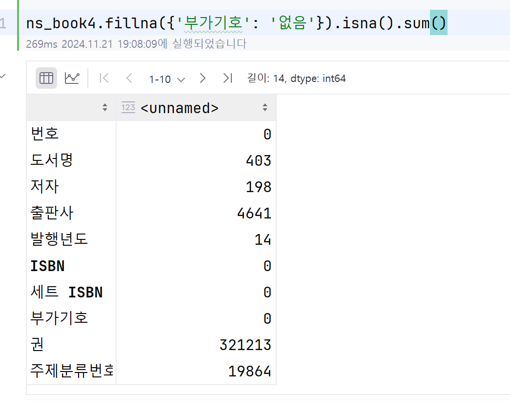

# 잘못된 데이터 수정하기
데이터가 중간중간 비어있을 경우 pandas는 data를 NaN으로 표기.

df.info() 메서드를 활용하여  df의 요약정보 확인가능.
이를 바탕으로 각 object별 누락 수를 구할 수 있음

(info()메서드는 원소 개수와 열 데이터 타입을 기반으로 메모리 사용량을 '추정'한다.
정확한 메모리 사용량을 알고싶으면 parameter로 memory_usage='deep'을 설정하자)

df.isna() 메서드를 활용하면 각 행이 비어있는지를 나타내는 불리안 배열을 반환한다. -> 여기에 sum을 걸면 누락 수만 구할 수 있음.

만약에 df의 첫 행이 NaN일 때 NaN은 실수로 취급되므로 int인 col이 전부 float로 변하게 된다. 이를 막기 위하여 첫 행에만 NaN값들을 
'astype()' 메서드를 활용하여 매개변수의 세팅을 전달할 수 있다.

astype으로 데이터의 세팅을 딕셔너리 형태로 전달해준 결과 '도서권수', '대출건수' 항목이 int로 설정되었다.

### 누락된 값 바꾸기1 : loc
loc 메서드를 활용하여 누락된 값을 원하는 값으로 바꿀 수 있다. -> 이를 위하여 누락여부를 알려주는 불리안 배열을
만들어야 한다 -> isna() 메서드 활용

누락된 값을 전부 빈 문자열로 처리했기 때문에 누락된 값은 없음 -> sum=0

### 누락된 값 바꾸기2 : fillna()

NaN을 '없음' 으로 재설정. fillna()를 df전체에 적용했을 경우에는 df전체가 반환되지만
위 그림과 같이 df의 특정 col을 지정하여서 사용해버리면 반환되는 값도 df전체가 아니라 col만 반환.

위 코드처럼 col name과 바꿀 값을 {'딕셔너리' : 'value'} 형태로 입력하면 return이 수정된 df전체로 나옴

### 누락된 값 바꾸기3 : replace() ★

replace() 메서드는 가장 많이 사용되는 메서드이다. NaN은 물론 어떤 값도 바꿀 수 있다. 그만큼 사용법도 다양하다.

#### 사용법1. 바꾸려는 값이 하나일 때 -> replace(원래 값, 바꿀 값)
#### 사용법2. 바꾸려는 값이 여러개일 때 -> replace([원래 값1, 바꿀 값1], [원래 값2, 바꿀 값2])
리스트 형식으로 전달함. (딕셔너리 형태도 가능함)
#### 사용법3. 열마다 다른 값으로 바꿀 때 -> replace({열 이름 : 원래 값}, 바꿀 값)
해당 열의 원래 값 을 바꿀 값으로 변경

## 정규식
정규식은 문자열 패턴을 지정할 수 있음. -> 직접 외워서 생성하는건 미련하고 gpt나 정규식 생성기를 활용하도록 하죠.

기본개념만 적어둡시다.
##### 정규식 시작 표현 : r
##### 정규식 반복 시 : {갯수}
##### 숫자 찾기 : \d
##### 문자 찾기 : .(마침표)
##### 괄호를 일반 문자로 인식하게 하려면 '\'사용
##### 공백 문자 : \s