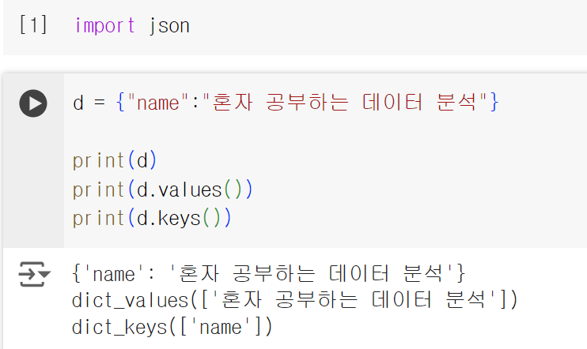
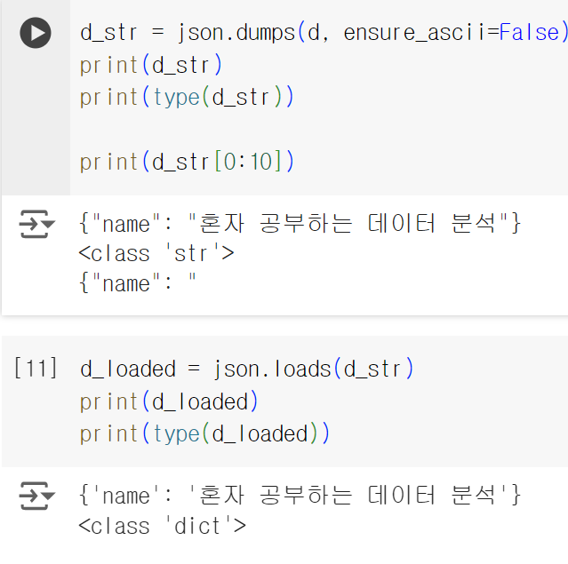
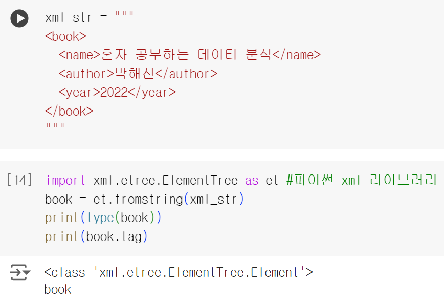
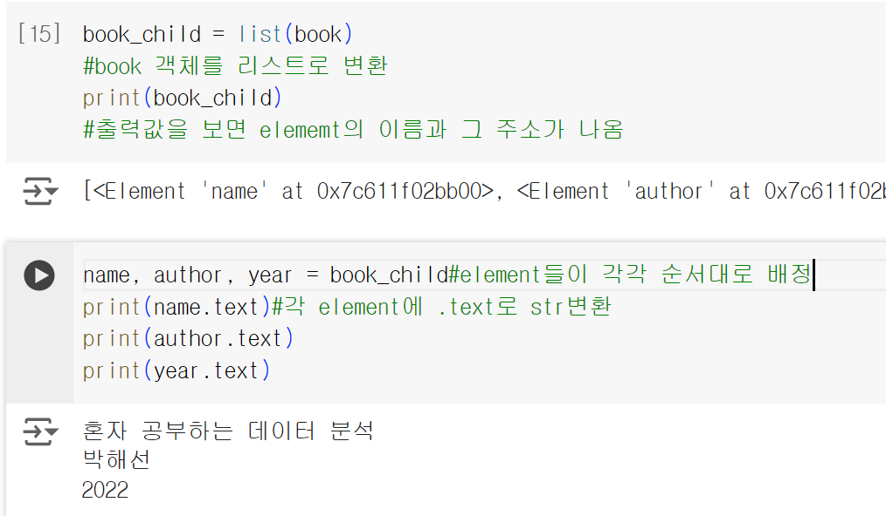
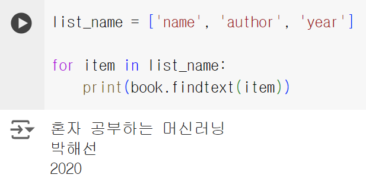
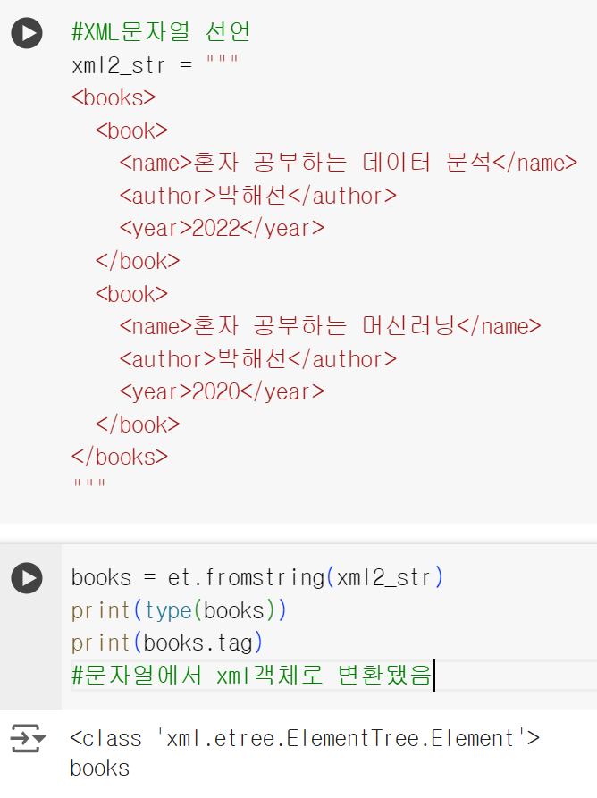
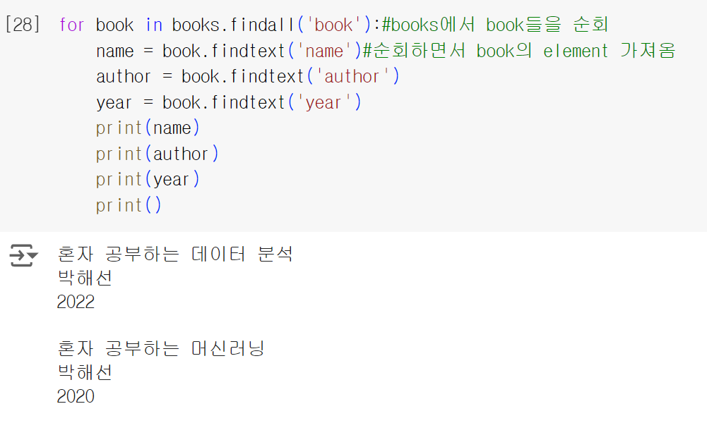

# 혼자 공부하는 데이터 분석 - Chap02_1
2024-10-25

## JSON
api 콜을 위해서 json 문자열을 파이썬으로 다룰 수 있어야 한다.

API들은 보통 json문자열을 사용하기 때문에 특히 'json문자열'과 '파이썬 json객체'의 구분이 중요

### Json 문자열 구조
{"key" : "value"} 구조임. 파이썬에서는 딕셔너리로 취급함

### 그럼 딕셔너리(파이썬객체)를 Json 문자열로 바꿔줘야겠지?

파이썬 딕셔너리 형태의 json을 'json.dumps()' 메서드를 활용하여 100% 진또배기 문자열로 바꿔줄 수 있음
(직렬화)

ensure_ascii=False 세팅을 한 이유는? -> 한글은 아스키 코드에 없어서 아스키 모드는 꺼야함

'json.loads()' 메서드를 이용하여 json문자열을 파이썬 딕셔너리 객체로 바꿀 수 있음(역직렬화)

### 값은 어떻게 찾아오지?
파이썬 딕셔너리 객체 형태의 json은 d['key'] 이런식으로 가져오면 됨
물론 딕셔너리 안에 리스트 중첩형태도 가능함 -> d['key'][index] 형태 가능

딕셔너리 문자열을 선언할 때 """[ ]"""을 잘 사용하자~

### 더 간편한 방법 없나? (Json 문자열을 DataFrame으로 변환 : read_json() )
Pandas에서 json문자열을 바로 dataframe으로 바꿔줄 수 있음

pd.read_json(json문자열) 형태로 사용하면 됨

## XML
API에서는 XML도 사용됨.

XML은 element 계층구조를 사용함(부모 <-> 자식)

### XML 문자열 구조 및 역직렬화
보면 알겠지만 파이썬에서 xml을 사용하기 위해서 xml.etree.ElementTree 라이브러리르 사용함

따라서 역직렬화를 했을 때 그 DataType이 해당 라이브러리의 class로 나타남

(.tag 는 element의 이름을 확인함)

객체 변환 및 값 배정

element들을 알고있으면 리스트에 반복문 활용해서 출력도 가능

### XML문자열 -> 파이썬객체 (역직렬화) : fromstring()함수

### XML은 배열이 없다!

따라서 같은 이름의 element가 2개 이상 있으면 그의 상위(부모) element를 추가해야한다.

### findall() 메서드와 findtext() 메서드를 활용한 element찾기
element가 순서대로 정렬되어 있을거라는 보장이 없음.
findtext('name') 메서드를 활용하면 name으로 element를 찾아옴

findall()메서드는 여러개의 자식 엘리먼트를 찾을 수 있음

반복문을 활용한 예시

여기서 book 엘리먼트를 findall()로 찾으니까 2개가 반환된다. 이를 for문을 활용하여 순회.

## 정리
JSON의 경우 API에서 사용할 text를 json.loads() 메서드 활용하여 파이썬 객체로 역직렬화

XML은 xml.etree.ElementTree 의 et.fromstring()을 사용하여 루트 element 추출

findall() 메서드로 자식 element의 텍스트 추출 가능

## 판다스 꿀팁
판다스를 활용하면 json문자열이나 xml문자열을 바로 데이터프레임으로 변환한다.

pd.read_json() 메서드와 pd.read_xml()메서드를 활용하자